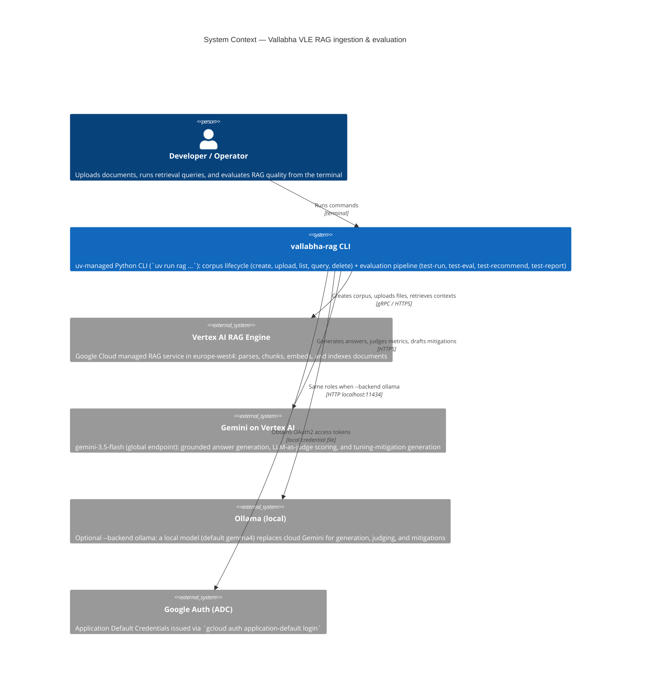
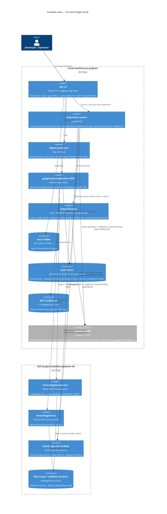
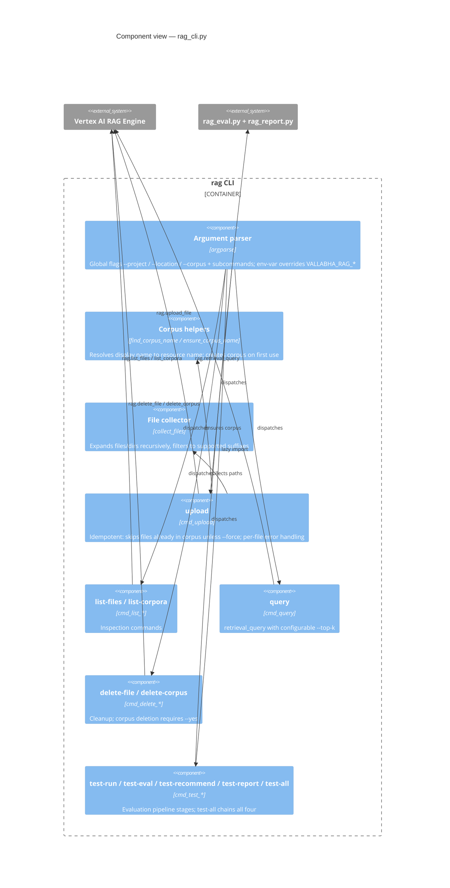
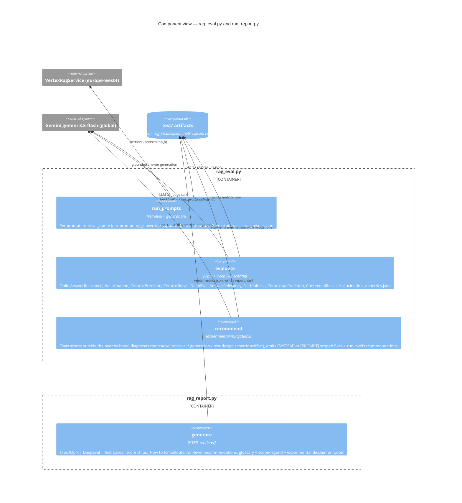
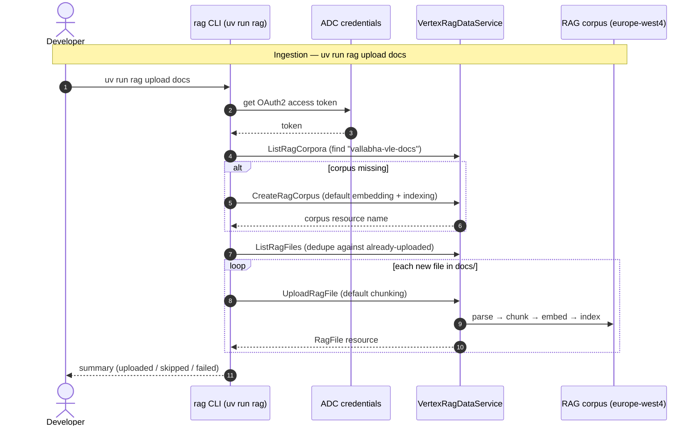
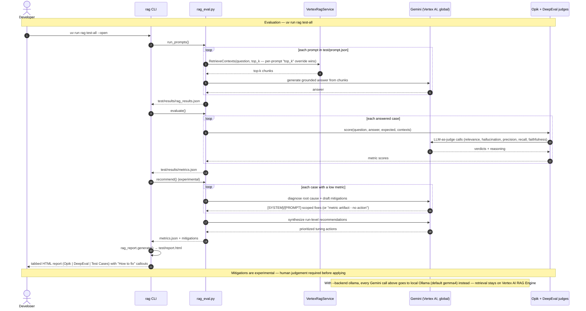
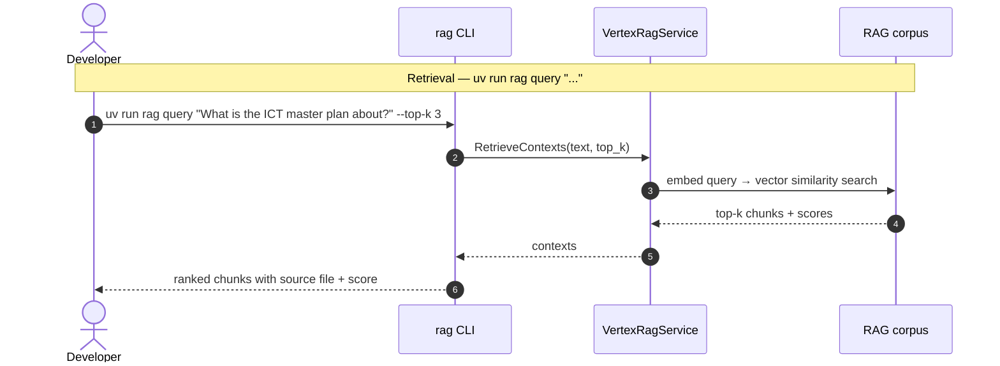

# vallabha-rag

CLI for managing a **Vertex AI RAG Engine** corpus in the **Vallabha VLE** GCP project
(`vallabha-systems-vle`, region `europe-west4`).

Built as a [uv](https://docs.astral.sh/uv/) Python project. Uses Application Default
Credentials (ADC) and the RAG Engine **default** embedding model, chunking, and
indexing strategies (no custom `TransformationConfig` is passed, so service defaults apply).

Beyond corpus management, the CLI ships an **evaluation suite**: test prompts are
answered via retrieval + Gemini generation, scored by **Opik** and **DeepEval**
LLM-as-judge metrics, diagnosed into experimental `[SYSTEM]`/`[PROMPT]`-scoped
tuning mitigations, and rendered into a tabbed HTML report.

---

## Architecture (C4 model)

### Level 1 — System Context



### Level 2 — Containers



### Level 3 — Components (rag_cli.py)



### Level 3 — Components (evaluation subsystem)



### End-to-end flows







---

## Setup

```sh
uv sync                                 # install dependencies + the `rag` entry point
gcloud auth application-default login   # once, or whenever the ADC token expires
```

Requires the Vertex AI API (`aiplatform.googleapis.com`) to be enabled in the project
(already enabled for `vallabha-systems-vle`).

## Usage

### Upload documents

```sh
# Upload everything in docs/ — creates the corpus on first run,
# skips files already in the corpus (idempotent, safe to re-run)
uv run rag upload docs

# Upload specific files and/or folders
uv run rag upload report.pdf ./more-docs

# Re-upload files that already exist in the corpus
uv run rag upload docs --force
```

### Inspect

```sh
uv run rag list-corpora      # all corpora in the project/region
uv run rag list-files        # files in the default corpus
```

### Query (retrieval sanity check)

```sh
uv run rag query "What is the ICT master plan about?"
uv run rag query "Broadband targets for rural India" --top-k 10
```

### Cleanup

```sh
uv run rag delete-file ict-masterplan-final-.pdf   # by display name
uv run rag delete-corpus --yes                     # deletes the corpus and all its files
```

### Create the corpus without uploading

```sh
uv run rag create-corpus
```

### Evaluate RAG quality (Opik + DeepEval)

Test prompts live in `test/prompt.json` (factual, synthesis, cross-document, and
out-of-scope categories, each with a hand-written expected answer).

```sh
uv run rag test-run              # answer every prompt via retrieval + Gemini generation
uv run rag test-eval             # score answers with Opik + DeepEval LLM-as-judge metrics
uv run rag test-recommend        # diagnose low scores -> concrete tuning mitigations (experimental)
uv run rag test-report --open    # build test/report.html and open it in the browser

uv run rag test-all --open       # all four stages in one go
uv run rag test-run --top-k 10   # experiment with retrieval depth
```

A prompt entry in `prompt.json` may carry its own `"top_k": 10` field, which overrides
`--top-k` for that prompt alone — the smallest-scope tuning knob. Auto-generated
mitigations are tagged `[PROMPT]` (change one entry in `prompt.json`) or `[SYSTEM]`
(default top-k, chunking + re-upload, grounding prompt, model) so engineers know the
blast radius. **They are experimental — apply human judgement, prefer PROMPT-scope
fixes, and validate with a fresh `test-all` run.**

Artifacts land in `test/`:

- `test/results/rag_results.json` — question, generated answer, retrieved chunks + scores
- `test/results/metrics.json` — per-case and averaged Opik/DeepEval scores with judge reasoning
- `test/report.html` — self-contained tabbed report (Opik | DeepEval | Test Cases) with a
  metric glossary, prompt/chunk tuning guidance, and references in the footer

Metrics: answer relevance/relevancy, hallucination, faithfulness (DeepEval),
context(ual) precision, and context(ual) recall. The generation and judge model is
`gemini-3.5-flash` on Vertex AI (override with `VALLABHA_RAG_EVAL_MODEL`).

#### Local model backend (Ollama)

`test-run`, `test-eval`, `test-recommend`, and `test-all` accept `--backend` and
`--model` to swap the cloud frontier model for a local Ollama model — no cloud LLM
calls for generation, judging, or mitigations (document **retrieval still uses the
Vertex AI RAG Engine corpus**, so ADC is still needed):

```sh
uv run rag test-all --backend ollama --open        # local gemma4 end to end
uv run rag test-run --backend ollama --model gemma4
uv run rag test-eval --backend ollama              # judge with local gemma4
uv run rag test-run --backend vertex --model gemini-3-flash-preview   # other cloud model
```

Requires [Ollama](https://ollama.com) running locally with the model pulled
(`ollama pull gemma4`). Defaults: backend `vertex`; ollama model `gemma4`;
server `http://localhost:11434`. Env overrides: `VALLABHA_RAG_EVAL_BACKEND`,
`VALLABHA_RAG_OLLAMA_MODEL`, `VALLABHA_RAG_OLLAMA_URL`. Note that small local
models are noticeably weaker judges than frontier models — expect noisier scores
and treat cross-backend comparisons with care.

## Defaults and overrides

Every command accepts the global flags below (place them **before** the subcommand),
or set the corresponding environment variable.

| Setting | Default                | Flag         | Env var                 |
|---------|------------------------|--------------|-------------------------|
| Project | `vallabha-systems-vle` | `--project`  | `VALLABHA_RAG_PROJECT`  |
| Region  | `europe-west4`         | `--location` | `VALLABHA_RAG_LOCATION` |
| Corpus  | `vallabha-vle-docs`    | `--corpus`   | `VALLABHA_RAG_CORPUS`   |

Example:

```sh
uv run rag --corpus experiments upload docs
VALLABHA_RAG_LOCATION=europe-west3 uv run rag list-corpora
```

## Supported file types

`.pdf` `.txt` `.md` `.html` `.doc` `.docx` `.ppt` `.pptx` `.xls` `.xlsx` `.csv` `.json`

Other files in an uploaded folder are silently ignored; a nonexistent path prints a warning.

## Project layout

```
RAG/
├── docs/                       # source documents to ingest
├── test/
│   ├── prompt.json             # evaluation prompts + expected answers
│   ├── results/                # rag_results.json, metrics.json (generated)
│   └── report.html             # tabbed metrics report (generated)
├── rag_cli.py                  # CLI entry point (installed as the `rag` command)
├── rag_eval.py                 # retrieval+generation runner and Opik/DeepEval scoring
├── rag_report.py               # HTML report generator
├── pyproject.toml              # uv project; entry point rag = rag_cli:main
└── README.md
```
