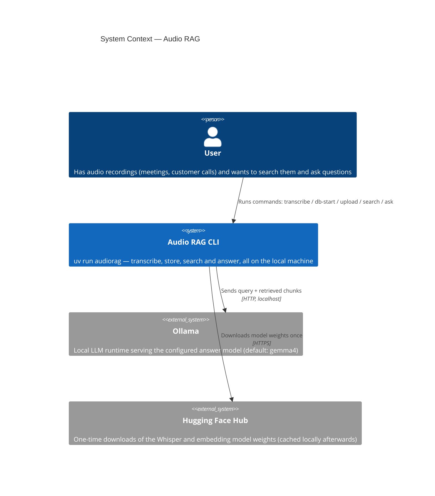
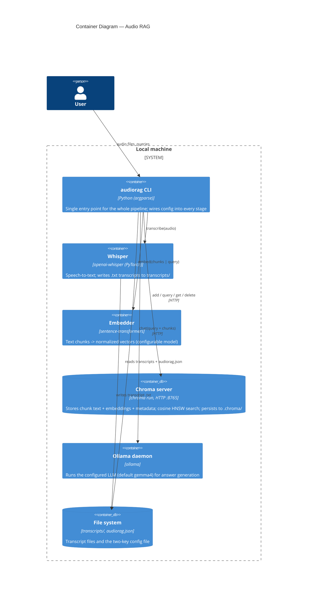
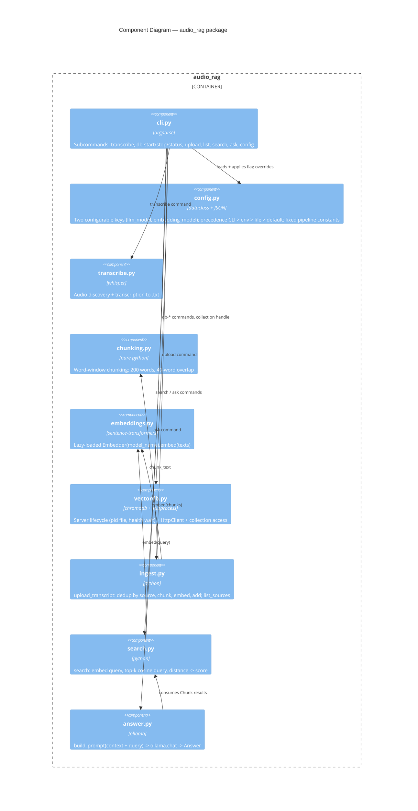
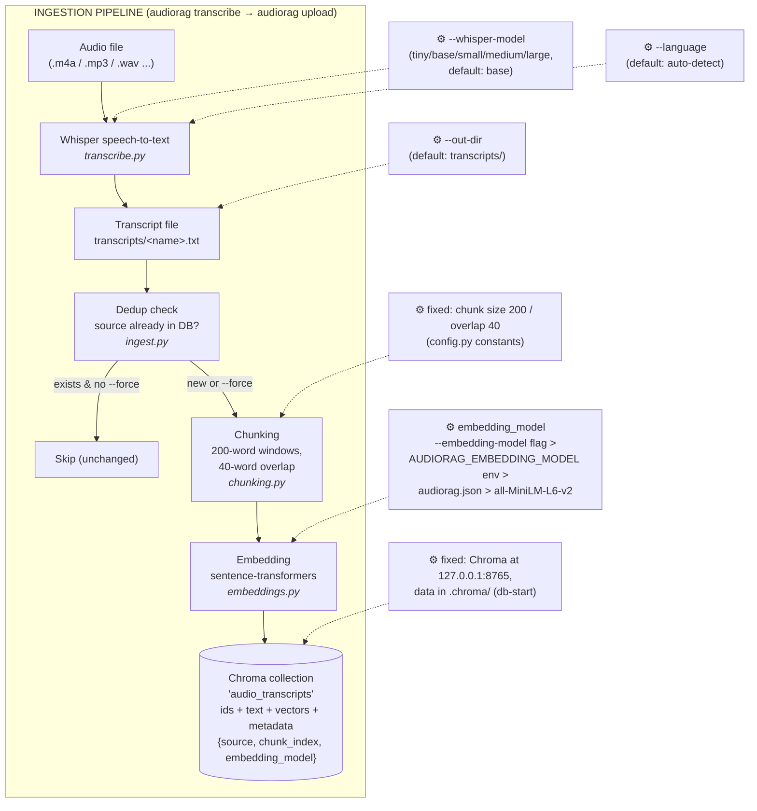
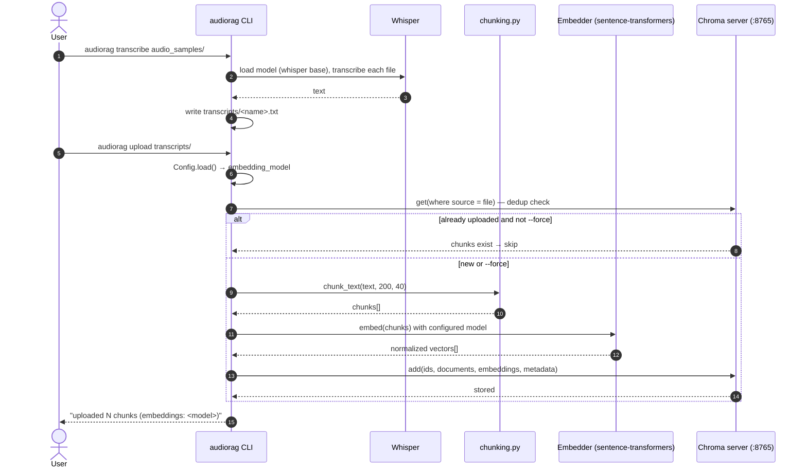
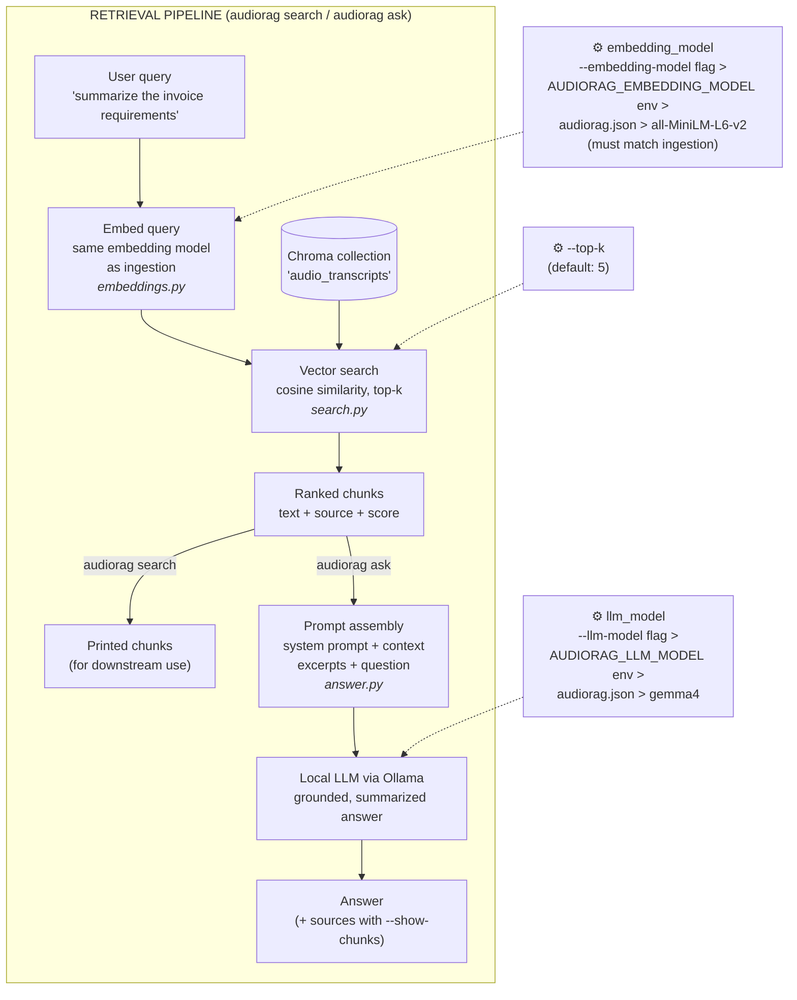
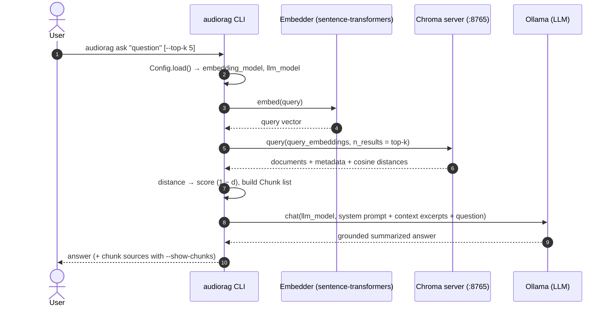

# Audio RAG — Architecture

A fully local Retrieval-Augmented Generation pipeline over audio recordings:
Whisper transcribes audio, a sentence-transformers model embeds transcript
chunks into a local Chroma vector database, and an Ollama-hosted LLM produces
grounded, summarized answers.

## Level 1 — System Context

## Level 2 — Containers

## Level 3 — Components (`audio_rag` package)

## Ingestion Pipeline — flow and configuration

How audio becomes searchable vectors, and where each configuration value
enters the pipeline (dashed boxes = config points):

## Retrieval Pipeline — flow and configuration

How a question becomes a grounded answer (`search` stops after retrieval;
`ask` continues into the LLM):

## Configuration model

Only two values are user-configurable; both flow through `config.py` with this
precedence (highest wins):

| Key | CLI flag | Env var | `audiorag.json` | Default |
|---|---|---|---|---|
| `llm_model` | `--llm-model` | `AUDIORAG_LLM_MODEL` | `config set llm_model X` | `gemma4` |
| `embedding_model` | `--embedding-model` | `AUDIORAG_EMBEDDING_MODEL` | `config set embedding_model X` | `all-MiniLM-L6-v2` |

Everything else is a deliberate one-time convention in `config.py`:
Whisper model `base` (per-run override via `--whisper-model`), Chroma at
`127.0.0.1:8765` with data in `.chroma/`, collection `audio_transcripts`,
chunking 200/40 words.

**Consistency rule:** the embedding model used at query time must match the one
used at ingestion (each chunk records its `embedding_model` in metadata; after
changing it, re-upload with `--force`).

## Data at rest

| Location | Contents |
|---|---|
| `transcripts/*.txt` | Whisper output, one file per audio recording |
| `.chroma/` | Chroma persistence (SQLite + HNSW index), `chroma.pid`, `chroma.log` |
| `audiorag.json` | The two configurable keys, written by `audiorag config set` |
